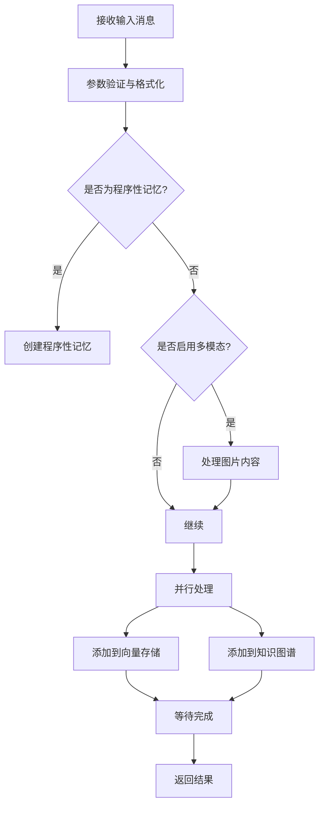
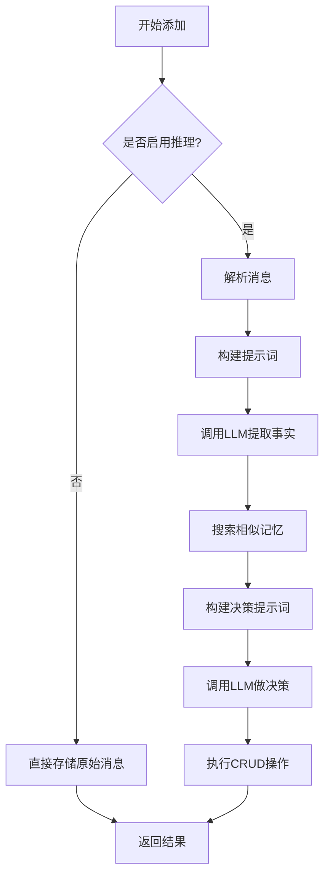
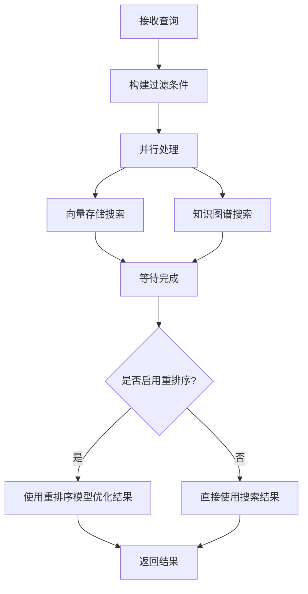

# mem0ry

基于 mem0 的智能记忆管理系统。

## 项目简介

mem0ry 是一个智能记忆管理系统，能够从对话中提取关键事实，存储为结构化记忆，并支持基于语义的记忆检索。

## 核心功能

- 从对话中提取关键事实并存储为记忆
- 智能管理记忆的生命周期（添加、更新、删除）
- 基于向量相似度的语义检索
- 支持知识图谱进行关系推理
- 灵活的后端配置，支持多种模型供应商

## 快速开始

```python
from mem0.memory.main import Memory
from mem0.configs.base import MemoryConfig

# 初始化
config = MemoryConfig()
memory = Memory(config)

# 添加记忆
messages = [
    {"role": "user", "content": "我叫张三，是一名软件工程师"}
]
result = memory.add(messages, user_id="user_123")

# 搜索记忆
result = memory.search("张三的职业是什么？", user_id="user_123")
print(result)
```

## 核心方法与技术实现

### Memory 类核心方法

| 方法名 | 功能描述 | 参数 | 返回值 | 技术要点 |
|-------|---------|------|--------|----------|
| `__init__` | 初始化 Memory 实例 | config: MemoryConfig | 无 | 初始化向量存储、嵌入模型、LLM、知识图谱等组件 |
| `add` | 添加新记忆 | messages: 消息内容<br>user_id/agent_id/run_id: 会话标识符<br>infer: 是否使用LLM提取事实 | dict: 操作结果 | 并行处理、多模态支持、智能决策 |
| `search` | 搜索记忆 | query: 查询内容<br>user_id/agent_id/run_id: 会话标识符<br>filters: 过滤条件 | dict: 搜索结果 | 向量相似度搜索、重排序、高级过滤 |
| `get` | 通过ID获取记忆 | memory_id: 记忆ID | dict: 记忆内容 | 向量存储查询 |
| `get_all` | 获取所有记忆 | user_id/agent_id/run_id: 会话标识符<br>filters: 过滤条件 | dict: 记忆列表 | 并行处理、结果格式化 |
| `_add_to_vector_store` | 添加记忆到向量存储 | messages: 消息内容<br>metadata: 元数据<br>filters: 过滤条件<br>infer: 是否推理 | list: 记忆操作结果 | LLM事实提取、记忆生命周期管理 |
| `_add_to_graph` | 添加记忆到知识图谱 | messages: 消息内容<br>filters: 过滤条件 | list: 实体关系 | 知识图谱集成 |

### 技术实现详解

#### 1. 记忆添加流程



#### 2. 向量存储添加流程（核心智能逻辑）



#### 3. 记忆检索流程



### 关键技术点

1. **智能记忆提取**：
   - 使用LLM从对话中提取关键事实
   - 支持自定义提取提示词
   - 区分普通用户记忆和Agent记忆

2. **记忆生命周期管理**：
   - 智能判断是添加、更新还是删除记忆
   - 避免记忆冗余
   - 保持记忆的一致性

3. **并行处理**：
   - 使用ThreadPoolExecutor并行处理向量存储和知识图谱操作
   - 提高处理效率

4. **多模态支持**：
   - 处理包含图片的消息
   - 将图片内容转换为文本记忆

5. **高级检索**：
   - 基于向量相似度的语义搜索
   - 支持复杂的元数据过滤条件
   - 可选的重排序功能，提高检索精度

6. **知识图谱集成**：
   - 自动提取实体和关系
   - 支持基于图的推理和查询

7. **灵活的后端配置**：
   - 支持多种向量存储（Qdrant、FAISS、Pinecone等）
   - 支持多种LLM（OpenAI、Anthropic、Azure等）
   - 支持多种嵌入模型和重排序器

## 高级配置

```python
from mem0.configs.base import MemoryConfig
from mem0.vector_stores.configs import VectorStoreConfig
from mem0.llms.configs import LlmConfig

config = MemoryConfig(
    vector_store=VectorStoreConfig(provider="qdrant"),
    llm=LlmConfig(provider="openai", config={"model": "gpt-4o"})
)
memory = Memory(config)
```

## 项目结构

### embeddings 目录
实现嵌入模型的适配器，支持以下模型：
- OpenAI (`openai.py`)
- Azure OpenAI (`azure_openai.py`)
- AWS Bedrock (`aws_bedrock.py`)
- Gemini (`gemini.py`)
- HuggingFace (`huggingface.py`)
- Ollama (`ollama.py`)
- FastEmbed (`fastembed.py`)
- Together (`together.py`)
- LMStudio (`lmstudio.py`)
- Vertex AI (`vertexai.py`)
- LangChain (`langchain.py`)

### graphs 目录
实现知识图谱功能，支持 Neptune 图数据库：
- Neptune DB (`neptune/neptunedb.py`)
- Neptune Graph (`neptune/neptunegraph.py`)

### llm 目录
实现 LLM 模型供应商适配器，支持：
- OpenAI (`openai.py`, `openai_structured.py`)
- Azure OpenAI (`azure_openai.py`, `azure_openai_structured.py`)
- Anthropic (`anthropic.py`)
- AWS Bedrock (`aws_bedrock.py`)
- Gemini (`gemini.py`)
- DeepSeek (`deepseek.py`)
- Groq (`groq.py`)
- Ollama (`ollama.py`)
- Together (`together.py`)
- vLLM (`vllm.py`)
- XAI (`xai.py`)
- Sarvam (`sarvam.py`)
- LMStudio (`lmstudio.py`)
- LiteLLM (`litellm.py`)
- LangChain (`langchain.py`)

### reranker 目录
实现重排序模型，支持：
- Cohere (`cohere_reranker.py`)
- HuggingFace (`huggingface_reranker.py`)
- Sentence Transformer (`sentence_transformer_reranker.py`)
- LLM-based (`llm_reranker.py`)
- Zero Entropy (`zero_entropy_reranker.py`)

### vector_stores 目录
实现向量存储适配器，支持：
- Qdrant、FAISS、Pinecone、Weaviate
- Chroma、Milvus、MongoDB、Redis
- PostgreSQL (pgvector)、Elasticsearch、OpenSearch
- Azure AI Search、Supabase、Upstash
- 以及更多...